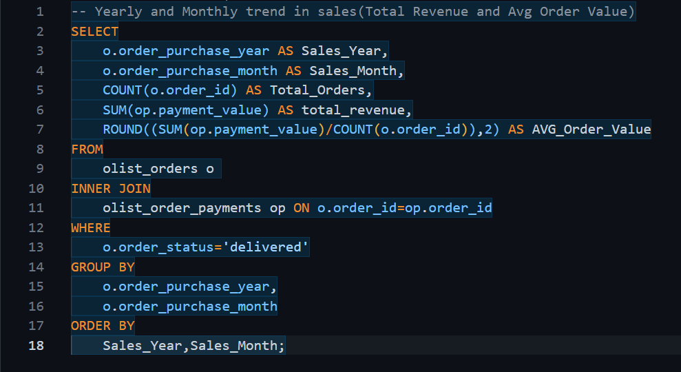
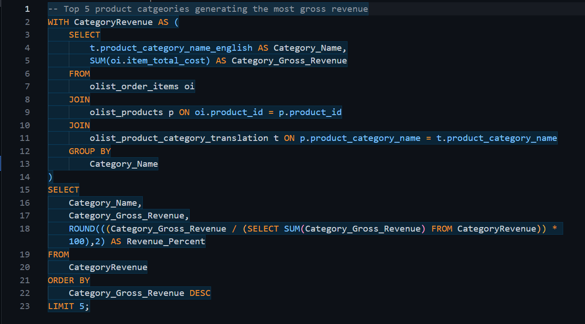
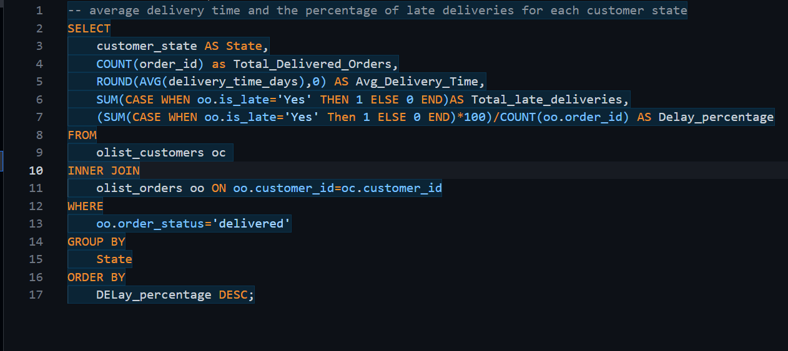
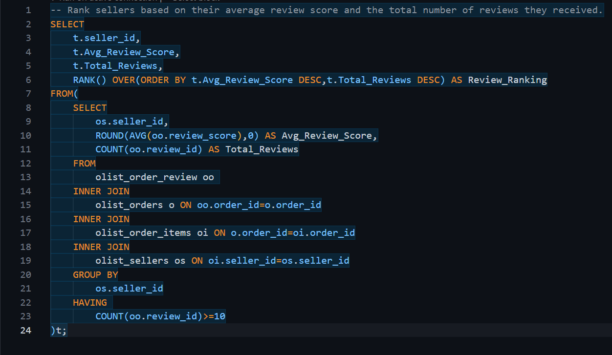
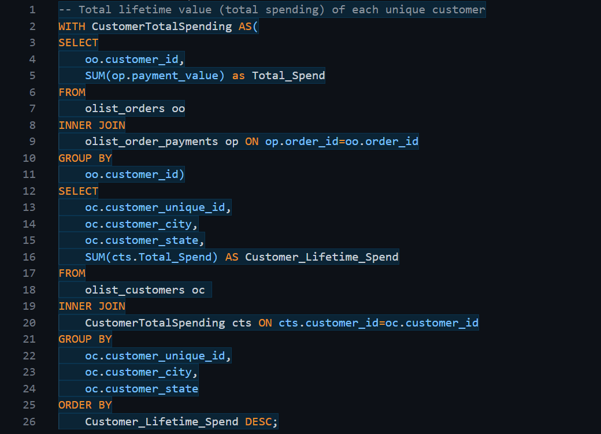
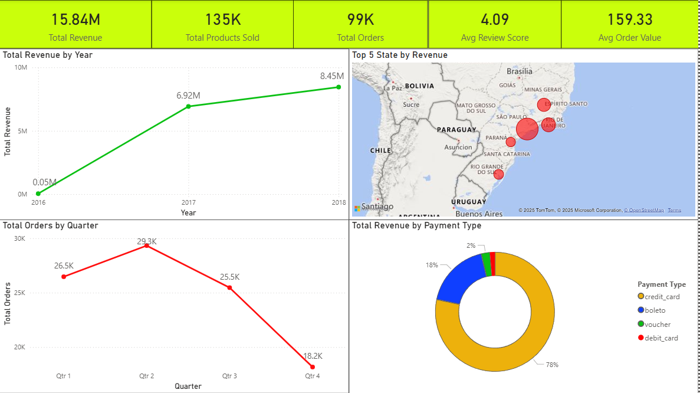
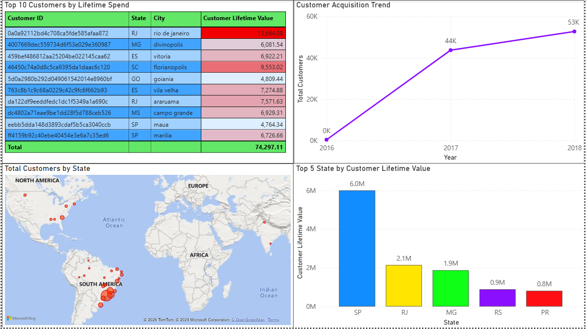
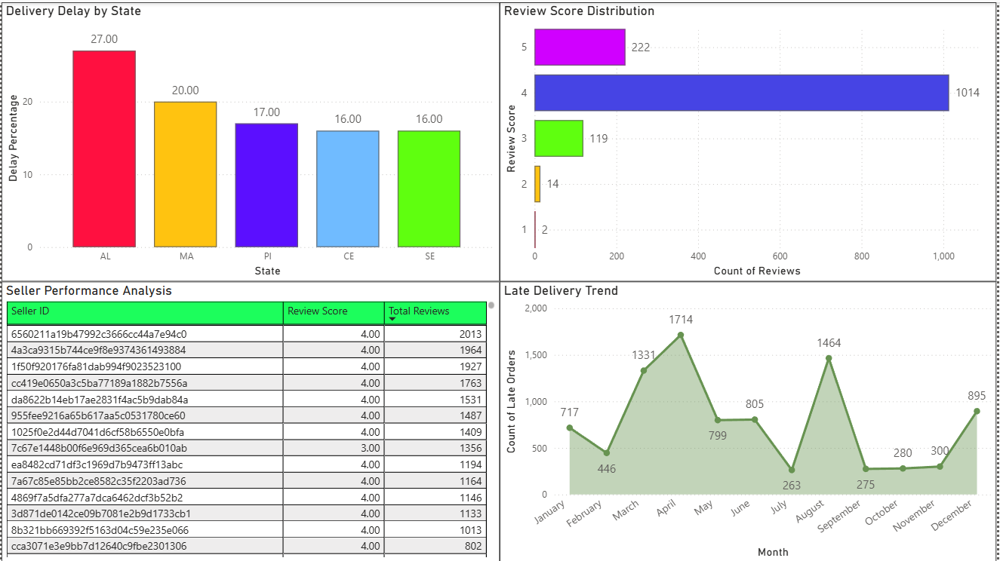

# <u>E-Commerce Sales Analytics Project Documentation<u>
* **By:** **Jeet Sarkar**
* **Tools Used:** Excel, MySQL, Power BI
* **Dataset Credit:** Brazilian E-Commerce Public Dataset by Olist

## **Project Overview**
In this project I performed an **end-to-end analysis** of the Olist E-commerce dataset to understand Sales, Product, Customer, Order, Payment, Reviews, and Delivery insights. The analysis is divided into structured stages typically followed in real business environments:
**1.	Understanding Business Requirement**
**2.	Data Collection & Structure Understanding**
**3.	Data Preprocessing & Data Cleaning (Excel + Power Query)**
**4.	Data Modelling & SQL Analysis (MySQL)**
**5.	Feature Table Creation for Power BI (using Views)**
**6.	Dashboard Building (Power BI)**
**7.	Insights, Interpretation & Recommendations**

## **Tools Used & Purpose**
### **Excel / Power Query**
Used for:
*	Checking raw datasets
*	Removing duplicates
*	Handling missing values
*	Replacing Nulls with Median Value (if requires)
*	Pre-cleaning before loading into SQL
*	Ensuring consistent data types

### **MySQL**
Used for:
*	Creating database schema
*	Data cleaning (structural + relational)
*	Data transformation
*	Developing SQL scripts for business questions
*	Creating Views for Power BI
*	Using advanced SQL:
*	Joins
*	Aggregations
*	Window Functions
*	Subqueries
*	CTEs
*	Derived metrics
### **Power BI**
Used for:
*	Data modelling
*	Building relationships between tables
*	DAX Measures
*	Creating dashboards for:
*	Sales & Revenue Analysis
*	Product & Category Insights
*	Customer & CLV Analysis
*	Seller & Delivery Performance
## **Dataset Description**
The Olist dataset contains multiple tables:
|**Table**|**Description**|
| :--- | ---: |
|**Customers**|Customer Demographic Details|
|**Sellers**|Seller Demogrpahic Details|
|**Geolocation**|Zip code and geogrpahical mapping|
|**Orders**|Order-level details|
|**Order_items**|Items within each order|
|**Order_payments**|Payment method and amounts|
|**Order_reviews**|Customer Reviews|
|**Products**|Product attributes|
|**Product_category_name_translation**|Mapping Portugese → English|

## <u>**Stage 1 – Business Requirement Understanding**<u>
Key questions I wanted to answer:
### **Sales & Revenue**
*	Total revenue? Monthly trends?
*	Top cities/states contributing to sales?
*	Top-performing sellers?
### **Product & Category**
*	Best-selling categories?
*	High revenue categories?
*	Category performance compared to delivery time?
### **Customer & CLV**
*	Where are most customers located?
*	Repeat customers vs new customers?
*	Customer Lifetime Value?
### **Order & Delivery**
*	Average delivery time?
*	Orders delayed vs delivered on time?
### **Reviews**
*	Which categories have highest/lowest review scores?
*	Relationship between delivery time and rating?

## <u>**Stage 2 – Data Cleaning (Excel + Power Query)**<u>
### **General Rules Followed Across All Tables**
*	Remove duplicates
*	Fix incorrect data types
*	Standardize date columns
*	Replace blank → NULL
*	Trim whitespaces
*	Remove rows with extreme missing values
*	Check foreign key consistency
### **Tables Cleaned**
|**Table**|**Cleaning Actions Performed**|
| :--- | ---: |
|**Customers**|Removed duplicate customer_id, standardized zip code prefix, ensured FK with geolocation|
|**Geolocation**|Standardized city/state naming, removed invalid coordinates or duplicates|
|**Sellers**|Similar cleaning as customers|
|**Orders**|Ensured proper datetime format, removed invalid timestamps, checked FK consistency|
|**Order_items**|Checked product_id and seller_id mapping|
|**Order_payments**|Ensured numeric payment values|
|**Order_reviews**|Standardized review dates, validated review scores|
|**Products**|Cleaned dimensions, ensured category mapping|
|**Category_translation**|Verified unique Portuguese → English mapping|

## <u>**Stage 3 – SQL Database Setup (MySQL)**<u>
### **Actions Performed**
*	Designed schema with PK–FK relationships
*	Imported tables
*	Checked referential integrity
*	Converted date strings → DATETIME
*	Verified no orphan rows

## <u>**Stage 4 – SQL Analysis (Business Questions)**<u>
I created SQL questions covering **all core and advanced SQL skills**:
**1.	Sales & Revenue Performance (Using Aggregations & Joins)**
* **Business Question:** What is the monthly and yearly trend in sales (Total Revenue and Average Order Value)?

**2.	Top Product Category Analysis (Using CTEs & Joins)**
* **Business Question:** Which are the top 5 product categories generating the most gross revenue?

**3.	Delivery Performance by State (Using CASE Statements & Joins)**
* **Business Question:** What is the average delivery time and the percentage of late deliveries for each customer state?

**4.	Seller Review Ranking (Using Window Functions & Subqueries)**
* **Business Question:** Rank sellers based on their average review score and the total number of reviews they received.

**5.	Customer Lifetime Value (CLV) (Using CTEs & Complex Aggregation)**
* **Business Question:** What is the total lifetime value (total spending) of each unique customer?

## <u>**Stage 5 – Creating Views for Power BI**<u>
I created multiple Power BI ready views:
|**View Name**|**Purpose**|
| :--- | ---: |
|**v_yearly_sales_summary**|Final dataset for sales dashboard|
|**v_customer_clv**|Customer-level metrics|
|**v_top_product_category**|Category & product insights|
|**v_delivery_performance**|Delivery performance & delay metrics|
|**v_seller_review_rank**|Review score mapping|
These views reduced Power BI transformations and ensured faster refresh.

## <u>**Stage 6 – Power BI Dashboard**<u>
Created dashboards including:
### **1. Sales & Revenue Analysis**
*	Total Revenue by Year
*	Total Orders by Quarter
*	Top 5 State by Revenue
*	Total Revenue by Payment Type

### **2. Product & Category Analysis**
*	Top Categories by Revenue
*	Category Revenue by Month
*	Price vs Freight Cost
*	Average Price vs Average Volume

### **3. Customer & CLV Dashboard**
*	Top 10 Customers by CLV (Customer Lifetime Value)
*	Customer Acquisition Trend
*	Top 5 State by CLV
*	Total Customers by State

### **4. Seller & Delivery Performance**
*	Delivery Delay by State
*	Review Score Distribution
*	Late Delivery Trend
*	Seller Performance Analysis

## <u>**Stage 7 – Final Insights & Recommendations**<u>
### **Business Insights**
*	Revenue is growing strongly (up to $8.45M in 2018), but **Orders drop sharply in Q4** (18.2K orders), indicating high seasonal volatility.
*	Late orders **peak consistently in April and August**. State **AL** has the highest delay percentage (27%).
*	Customer acquisition shows a **significant drop-off in the latter half of 2018** (from 7.4K to 0.8K customers/month).
*	**Sao Paulo (SP)** dominates both Total Revenue and Customer Lifetime Value ($6.0M CLV), creating high geographic risk.
*	High-price **Health & Beauty** has low volume. Low-price **Furniture & Decor** has the highest volume but also the highest freight cost.
### **Recommendations**
*	**Launch a Strategic Q4 Sales Campaign** focused on promotions/discounts to stabilize order volume and prevent the year-end decline.
*	**Investigate and address the 2018 Acquisition Decline** by reviewing marketing spend, competitive landscape, and channel performance during that period.
*	**Shift Marketing Spend** to increase customer acquisition in states with lower CLV but high potential (e.g., MG, RS) to diversify the customer base.

